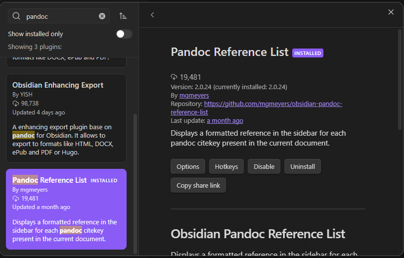

- Why using Markdown?
- We assume that MS Word will be needed for publishing.
  - We use Word only for formatting.
  - The authoritative source for the content remains the markdown file.
- We assume you have Obsidian and Zotero installed
  - [Download - Obsidian](https://obsidian.md/download)
  - [Zotero | Downloads](https://www.zotero.org/download/)

## Use citations from Zotero in Obsidian

- Install the BetterBibTex Plugin
  - [Installation - Better BibTeX for Zotero (retorque.re)](https://retorque.re/zotero-better-bibtex/installation/index.html)
  - Download the latest release in XPI format
  - Follow the installation instructions in the link above

- Export Library to BibLaTex file
  - Choose File > Export Library
  - Use Better BibLaTex Format
  - Tick "Keep updated"
  
  
  - Save it to any path. I use `%AppData%/Roaming/obsidian`
    - But it can be any other path as long as it does not contain any spaces
      - This is due to a limitation in the Pandoc obsidian plugin: https://github.com/OliverBalfour/obsidian-pandoc/issues/159
    - It is useful to not put the file on any synced folder (OneDrive, Dropbox) to avoid sync conflicts
    - it can be anywhere where you will find it again:
    
    
    - Write this path down, we will use it a lot
- In Obsidian 
  - Enable Community Plugins
  - Click Browse
  - install the "Citations" Plugin by Jon Gauthier: 

  
  - Click Install/Enable/Options
    - Change the Citation database format to "BibLaTex"
    - Change the Citation database path to the full path of the BibLaTex File that you have exported above.


- In Obsidian open the command palette and run "Citations: Refresh citation database"
- Create a new document in Obsidian 
  - Any Markdown file will do
  - It does not matter how it is called
  - Place the cursor anywhere in the file
- From the command palette run "Citation: Insert Markdown citation"
  - This will show a popup from which the citations can be selected.

 
  - This will insert the citation key in the following syntax `[@key]`. You can add page numbers after the comma; `[@key, p. 12]`
  - If you want to mention the article in the style Author (year). "According to Smith (1992) bla... " remove the brackets: `"According to @smith1992 bla..."`
  - See here for more details: [Pandoc Citation syntax](https://pandoc.org/chunkedhtml-demo/8.20-citation-syntax.html)
  - Also you might want to set yourself a convenient hotkey for the "Insert markdown citation command"
## Export a markdown document with citations to MS Word

- Install Pandoc
  -  [Pandoc - Installing pandoc](https://pandoc.org/installing.html)
- In Obsidian Install the community plugin "Pandoc" by Oliver Balfour


  - Enable the plugin and click options
    - Change "Export files from HTML or markdown" to "Markdown"
    Add the following to "Extra Pandoc Arguments":

```shell
-s --toc --citeproc --metadata bibliography="C:\Users\YOURUSER\AppData\Roaming\obsidian\MyLibrary.bib"
```

- Use as the Path to the bibliography the full path to your BibLaTex file.
    

    
   > **Note:** If the Plugin says, that Pandoc cannot be found in your path, it helps to restart Obsidian
  
  - Again make sure that the path does not contain spaces.

- Go to the document that has the citations from an earlier step.
  - From the command menu choose "Pandoc Plugin: Export as Word document"
  - This creates a DOCX file, that will have the BibLaTex references expanded to literature citations and builds a Reference list at the end of the file.
  


## Extra: Make reference keys easier to read in Obsidian

- Install the Pandoc Reference List Plugin by mgmeyers:
  
  
  
  - Enable and open the options
  - Set the "path to the bibliography file" to your exported BibLaTeX file
  
  